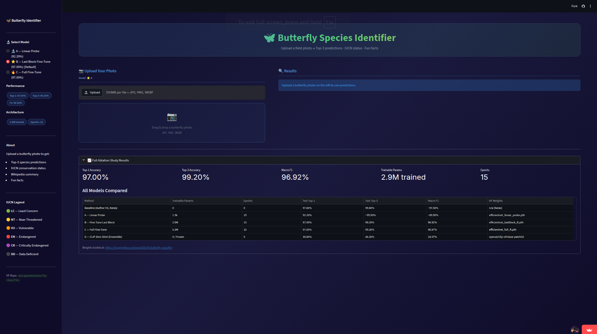
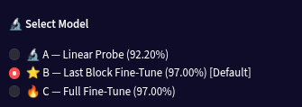
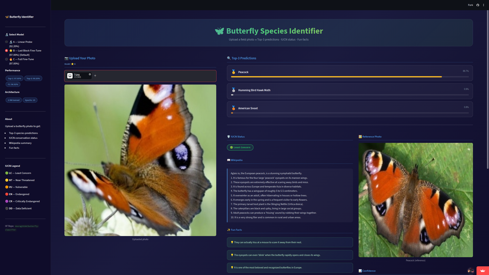
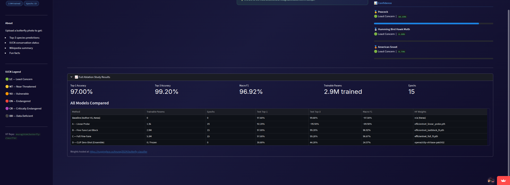

# 🦋 Butterfly Species Identifier

Upload a field photo → get the **species name**, **IUCN conservation status**, and a **Wikipedia summary** — instantly, in your browser.

Built for SMAI Assignment T7.4 using the [100-species Kaggle dataset](https://www.kaggle.com/datasets/gpiosenka/butterfly-images40-species).

---

## Results at a Glance

| Model | Strategy | Test Top-1 | Test Top-3 | Macro F1 |
|---|---|:---:|:---:|:---:|
| Baseline (Keras) | Pre-trained, no extra training | 97.60% | 99.60% | — |
| EfficientNet-B0 | Linear Probe | 92.20% | ~95.50% | ~89.50% |
| **EfficientNet-B0 ✅** | **Last Block Fine-Tune** | **97.00%** | **99.20%** | **96.92%** |
| EfficientNet-B0 | Full Fine-Tune | 97.00% | 99.20% | 96.87% |
| CLIP ViT-B/32 | Zero-shot ensemble | 30.80% | 44.20% | 24.57% |

The deployed app allows switching between the EfficientNet-B0 ablation models (all ~16 MB `.pth` files) downloaded seamlessly from the Hugging Face Hub.

---

## Frontend Screenshots

Here is a glimpse of the application interface:


*Landing page of the application, ready for user image upload.*


*Model selection dropdown in the sidebar.*


*Dynamic layout showing the model's prediction along with the fetched Wikipedia summary, IUCN status, and 3 fun facts.*


*Top-3 probability results table displayed immediately after inference.*

---

## Quick Start

### 1. Clone

```bash
git clone https://github.com/Anurag-Kacholiya/Butterfly-Species-Detection.git
cd Butterfly-Species-Detection
```

### 2. Install dependencies

```bash
pip install -r requirements.txt
```

> Python 3.9+ required. Use a virtual environment:
> ```bash
> python -m venv .venv && source .venv/bin/activate   # macOS / Linux
> python -m venv .venv && .venv\Scripts\activate       # Windows
> pip install -r requirements.txt
> ```

### 3. Run the app

```bash
streamlit run app.py
```

Opens at **http://localhost:8501** — drop a butterfly photo and see predictions.

---

## Project Structure

```
Butterfly-Species-Detection/
│
├── app.py                  # Streamlit app (entry point)
├── requirements.txt        # pip dependencies
├── report.tex              # LaTeX technical report
│
├── data/
│   ├── class_names.json             # Ordered list of 100 species
│   ├── species_metadata.json        # Wiki summaries, IUCN status, fun facts
│   └── species_images/              # Reference photos shown in the UI
│       └── *.jpg                    # One image per species
│
├── notebooks/
│   ├── 01_efficientnet_finetuning_final.ipynb   # EfficientNet training pipeline
│   └── 02_clip_zeroshot.ipynb                   # CLIP zero-shot pipeline
│
└── frontend_SS/                     # Screenshots for documentation
```

> The raw dataset (`archive/`) is not committed — download from Kaggle:
> `kaggle datasets download gpiosenka/butterfly-images40-species`

---

## Methodology

### Approach 1 — Zero-Shot CLIP (`02_clip_zeroshot.ipynb`)

Uses `openai/clip-vit-base-patch32` with **no gradient updates**. We ensemble 7 prompt templates per species (e.g. `"A close-up macro shot of a {species} butterfly"`) to create robust text anchors and compare via cosine similarity.

**Result: 30.8% Top-1.** CLIP knows what a butterfly looks like, but cannot distinguish 100 species whose differences live in wing venation details outside its training distribution.

### Approach 2 — Strategic Fine-Tuning on EfficientNet-B0 (`01_efficientnet_finetuning_final.ipynb`)

Two-phase transfer learning on `efficientnet_b0` (timm, ImageNet pre-trained):

| Phase | Action | Trainable Params | Epochs | Best Val Acc |
|---|---|:---:|:---:|:---:|
| 1 — Linear Probe | Freeze backbone; train head only | ~1.3 K | 15 | 92.20% |
| 2 — Last Block FT | Unfreeze `blocks.6` + head | 2.9 M (70%) | 15 | 96.20% |

**Result: 97.0% Top-1, 99.2% Top-3.** Matching full fine-tune accuracy (all 5.3 M params) at nearly half the trainable parameter cost.

Grad-CAM analysis confirms the model explicitly focuses on wing patterns and thorax — not the background habitat.

---

## Deployment (Streamlit Community Cloud)

1. Push the repo to GitHub.
2. Go to [share.streamlit.io](https://share.streamlit.io) → **New app**.
3. Set: Repository = `Anurag-Kacholiya/Butterfly-Species-Detection`, Branch = `main`, Main file = `app.py`.
4. Click **Deploy** — live in ~3 minutes at a `*.streamlit.app` URL.
